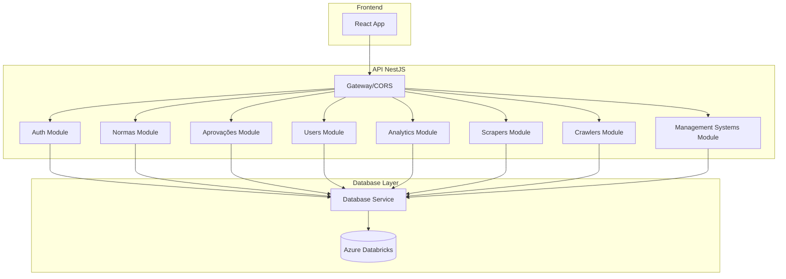
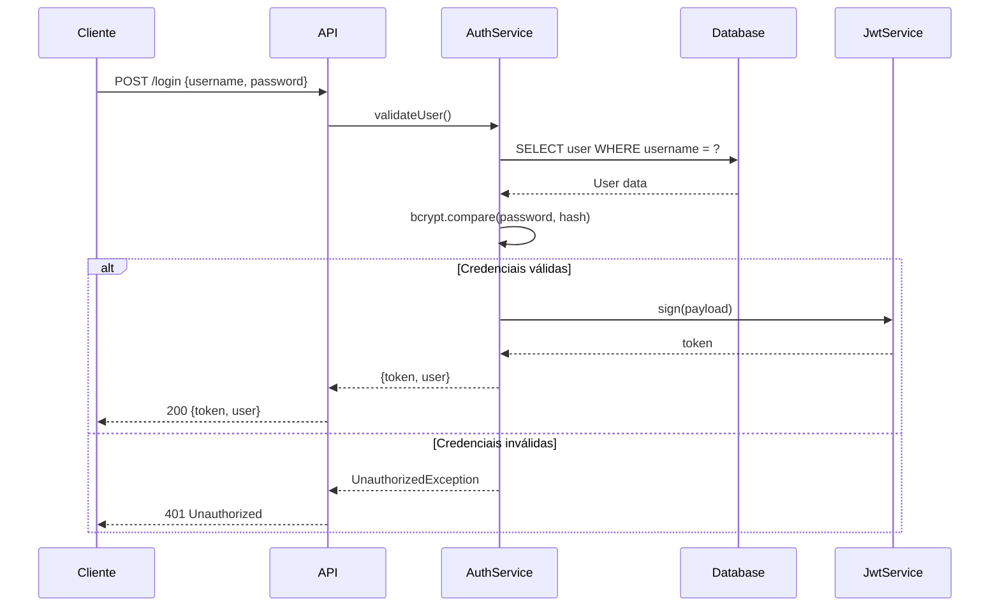
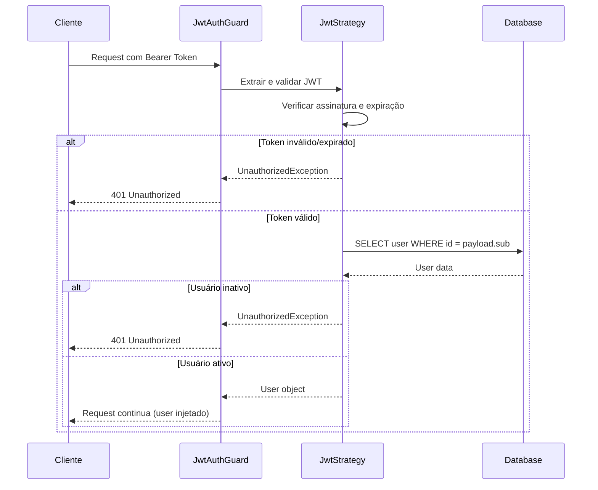
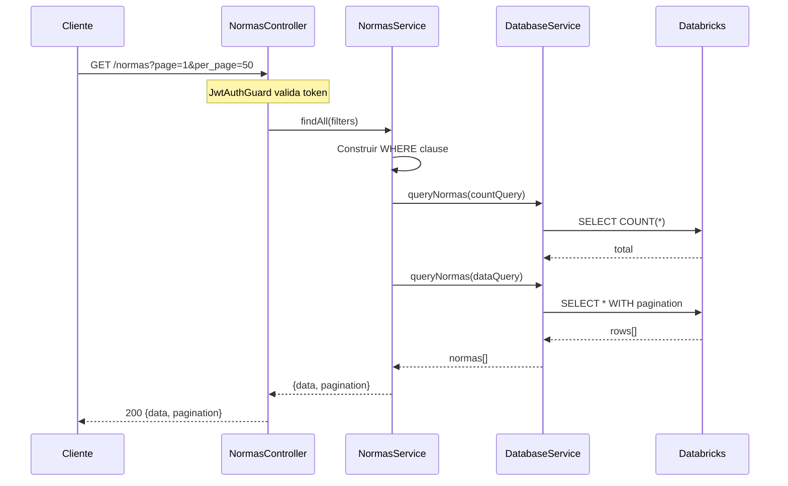
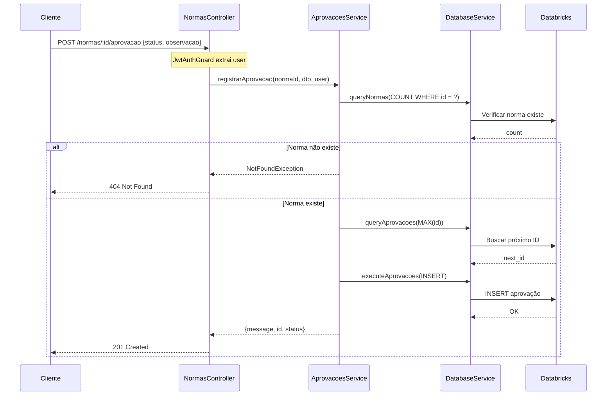
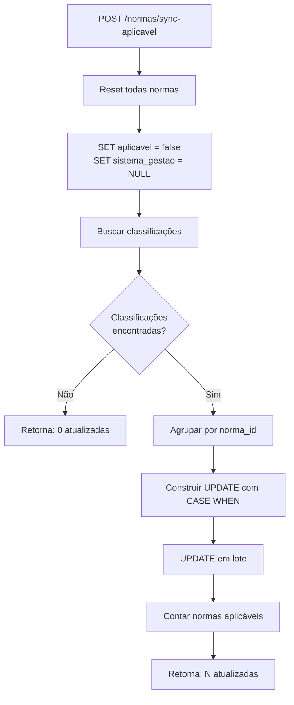
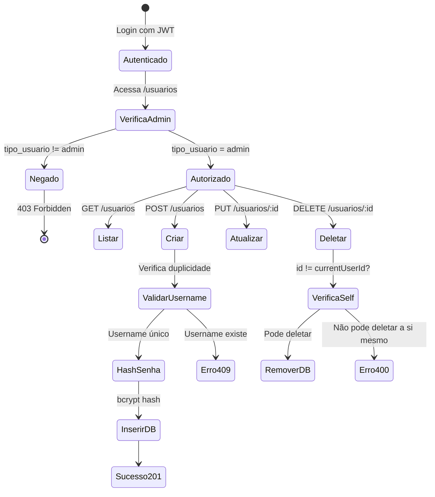
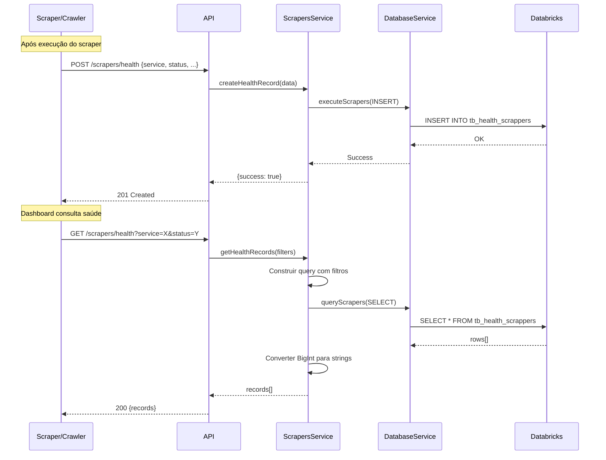
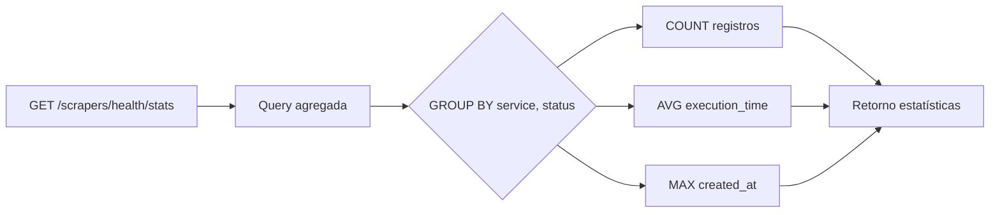
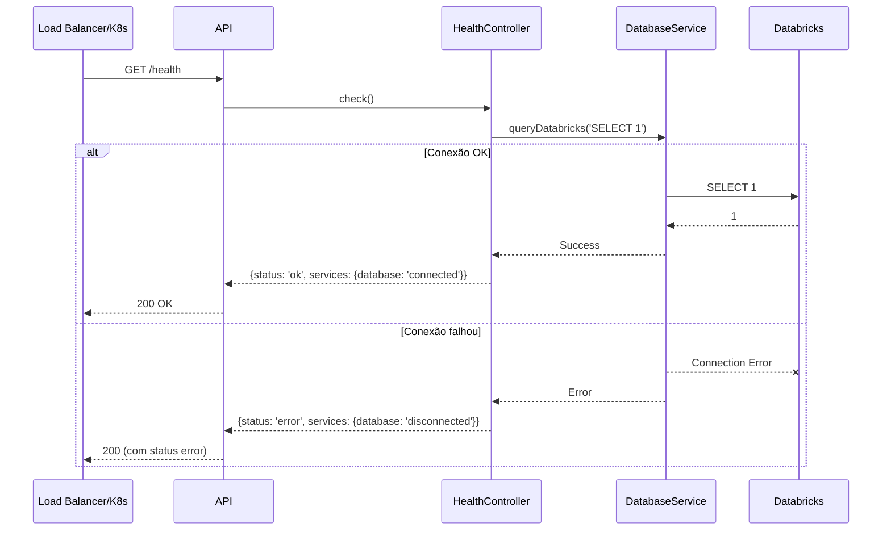

# 📚 API Normas Consolidadas - Documentação

## 📋 Índice

- [Visão Geral](#visão-geral)
- [Arquitetura](#arquitetura)
- [Autenticação](#autenticação)
- [Endpoints](#endpoints)
- [Fluxos](#fluxos)
- [Modelos de Dados](#modelos-de-dados)

---

## 🎯 Visão Geral

API REST desenvolvida em **NestJS** para gerenciamento de Normas Consolidadas, com integração ao **Azure Databricks**.

| Item | Valor |
|------|-------|
| Framework | NestJS 11 |
| Linguagem | TypeScript |
| Banco de Dados | Azure Databricks |
| Autenticação | JWT |
| Porta Padrão | 5001 |

---

## 🏗️ Arquitetura



---

## 🔐 Autenticação

### Fluxo de Login



#### Descrição das Etapas do Login

| Etapa | Componente | Ação | Detalhes |
|-------|------------|------|----------|
| 1 | Cliente | Envia credenciais | `POST /login` com body `{username, password}` |
| 2 | AuthController | Recebe requisição | Valida DTO com `class-validator` (campos obrigatórios) |
| 3 | AuthService | Busca usuário | Query no Databricks: `SELECT * FROM tb_usuarios WHERE username = ?` |
| 4 | Database | Retorna dados | Usuário com `id`, `username`, `password_hash`, `tipo_usuario`, `ativo` |
| 5 | AuthService | Verifica status | Se `ativo = false`, lança `UnauthorizedException('User is inactive')` |
| 6 | AuthService | Compara senha | `bcrypt.compare(password, password_hash)` - comparação segura |
| 7a | AuthService | Credenciais inválidas | Retorna `null` → Controller lança 401 |
| 7b | JwtService | Gera token | `sign({username, sub: user.id})` com secret e expiração |
| 8 | AuthService | Monta resposta | Remove `password_hash` e retorna `{token, user}` |
| 9 | Cliente | Recebe token | Armazena JWT para uso em requisições autenticadas |

#### Payload do JWT

```json
{
  "username": "admin",
  "sub": 1,
  "iat": 1703318400,
  "exp": 1703923200
}
```

| Campo | Descrição |
|-------|-----------|
| `username` | Nome de usuário |
| `sub` | ID do usuário (subject) |
| `iat` | Timestamp de emissão |
| `exp` | Timestamp de expiração (padrão: 7 dias) |

#### Validação do Token (JwtStrategy)



#### Descrição da Validação

| Etapa | Componente | Ação | Detalhes |
|-------|------------|------|----------|
| 1 | Cliente | Envia requisição | Header `Authorization: Bearer <token>` |
| 2 | JwtAuthGuard | Intercepta | Aplica estratégia JWT do Passport |
| 3 | JwtStrategy | Extrai token | `ExtractJwt.fromAuthHeaderAsBearerToken()` |
| 4 | JwtStrategy | Valida assinatura | Verifica com `SECRET_KEY` configurado |
| 5 | JwtStrategy | Verifica expiração | `ignoreExpiration: false` |
| 6 | JwtStrategy | Busca usuário | Consulta banco com `payload.sub` (ID) |
| 7 | JwtStrategy | Verifica status | Usuário deve estar com `ativo = true` |
| 8 | Guard | Injeta usuário | Adiciona `user` no objeto `request` |
| 9 | Controller | Acessa usuário | Via decorator `@CurrentUser()` |

### Headers de Autenticação

```
Authorization: Bearer <jwt_token>
```

---

## 📡 Endpoints

### Auth

| Método | Endpoint | Descrição | Auth |
|--------|----------|-----------|------|
| POST | `/login` | Login do usuário | ❌ |
| GET | `/me` | Perfil do usuário logado | ✅ |

### Normas

| Método | Endpoint | Descrição | Auth |
|--------|----------|-----------|------|
| GET | `/normas` | Listar normas (paginado) | ✅ |
| GET | `/normas/:id` | Buscar norma por ID | ✅ |
| POST | `/normas` | Criar nova norma | ✅ |
| PUT | `/normas/:id` | Atualizar norma | ✅ |
| DELETE | `/normas/:id` | Remover norma | ✅ |
| GET | `/normas/filtros/valores` | Valores disponíveis para filtros | ✅ |
| GET | `/normas/aplicaveis` | Listar normas aplicáveis | ✅ |
| GET | `/normas/stats` | Estatísticas de normas | ✅ |
| POST | `/normas/sync-aplicavel` | Sincronizar campo aplicável | ✅ |
| GET | `/normas/:id/management-systems` | Sistemas de gestão da norma | ✅ |
| POST | `/normas/:id/aprovacao` | Registrar aprovação | ✅ |
| GET | `/normas/:id/aprovacao` | Histórico de aprovações | ✅ |
| GET | `/normas/:id/aprovacao/status` | Status atual de aprovação | ✅ |

### Usuários (Admin)

| Método | Endpoint | Descrição | Auth |
|--------|----------|-----------|------|
| GET | `/usuarios` | Listar usuários | ✅ Admin |
| POST | `/usuarios` | Criar usuário | ✅ Admin |
| PUT | `/usuarios/:id` | Atualizar usuário | ✅ Admin |
| DELETE | `/usuarios/:id` | Remover usuário | ✅ Admin |
| GET | `/usuarios/:id/aprovacoes` | Aprovações do usuário | ✅ Admin |

### Aprovações

| Método | Endpoint | Descrição | Auth |
|--------|----------|-----------|------|
| GET | `/aprovacoes` | Listar aprovações | ✅ |
| GET | `/aprovacoes/:id` | Buscar aprovação | ✅ |
| POST | `/aprovacoes` | Criar aprovação | ✅ |
| PUT | `/aprovacoes/:id` | Atualizar aprovação | ✅ |
| DELETE | `/aprovacoes/:id` | Remover aprovação | ✅ |
| GET | `/aprovacoes/stats` | Estatísticas | ✅ |

### Analytics

| Método | Endpoint | Descrição | Auth |
|--------|----------|-----------|------|
| GET | `/analytics/origem-dado` | Por origem de dado | ✅ |
| GET | `/analytics/origem-publicacao` | Por origem de publicação | ✅ |
| GET | `/analytics/municipio` | Por município | ✅ |
| GET | `/analytics/sincronizacao` | Última sincronização | ✅ |
| GET | `/analytics/volume-dia` | Volume por dia | ✅ |
| GET | `/analytics/management-systems` | Sistemas de gestão | ✅ |

### Scrapers Health

| Método | Endpoint | Descrição | Auth |
|--------|----------|-----------|------|
| GET | `/scrapers/health` | Registros de saúde | ✅ |
| POST | `/scrapers/health` | Criar registro | ✅ |
| GET | `/scrapers/health/stats` | Estatísticas | ✅ |

### Health Check

| Método | Endpoint | Descrição | Auth |
|--------|----------|-----------|------|
| GET | `/health` | Status da API | ❌ |

---

## 🔄 Fluxos

### TODO - Fluxos a Documentar

- [x] Fluxo de Autenticação (Login e Validação JWT)
- [x] Fluxo de Listagem de Normas
- [x] Fluxo de Aprovação de Norma
- [x] Fluxo de Sincronização de Aplicáveis
- [x] Fluxo de CRUD de Usuários
- [x] Fluxo de Analytics
- [x] Fluxo de Scrapers Health
- [x] Fluxo de Health Check

---

### 1. Fluxo de Listagem de Normas



#### Descrição das Etapas

| Etapa | Componente | Ação | Detalhes |
|-------|------------|------|----------|
| 1 | Cliente | Envia requisição | `GET /normas` com query params: `page`, `per_page`, filtros opcionais |
| 2 | JwtAuthGuard | Valida token | Extrai e valida o JWT do header `Authorization: Bearer <token>` |
| 3 | NormasController | Recebe requisição | Extrai filtros da query string e repassa para o service |
| 4 | NormasService | Constrói filtros | Monta cláusula WHERE dinâmica baseada nos filtros recebidos |
| 5 | NormasService | Conta registros | Executa `SELECT COUNT(*)` para obter total de registros |
| 6 | DatabaseService | Traduz query | Converte placeholders `?` para valores e ajusta schema Databricks |
| 7 | Databricks | Executa count | Retorna número total de normas que atendem aos filtros |
| 8 | NormasService | Busca dados | Executa query paginada com `LIMIT` e `OFFSET` |
| 9 | DatabaseService | Executa query | Busca normas com subquery para último status de aprovação |
| 10 | NormasService | Monta resposta | Estrutura objeto com `data[]` e metadados de `pagination` |
| 11 | Cliente | Recebe resposta | JSON com normas e informações de paginação |

**Filtros Disponíveis:**
- `tipo_norma` - Tipo da norma (Lei, Decreto, Portaria, etc.)
- `status_vigencia` - Status de vigência (Vigente, Revogada, etc.)
- `divisao_politica` - Município/Estado
- `origem_publicacao` - Fonte de publicação
- `origem_dado` - Origem do dado (SITE, CRAWLERS, etc.)
- `aplicavel` - Se é aplicável (true/false)
- `status_aprovacao` - Status de aprovação
- `search` - Busca textual na ementa e número

---

### 2. Fluxo de Aprovação de Norma



#### Descrição das Etapas

| Etapa | Componente | Ação | Detalhes |
|-------|------------|------|----------|
| 1 | Cliente | Envia aprovação | `POST /normas/:id/aprovacao` com body `{status, observacao}` |
| 2 | JwtAuthGuard | Extrai usuário | Decodifica JWT e injeta dados do usuário na requisição |
| 3 | NormasController | Delega ao service | Passa `normaId`, DTO validado e objeto `user` |
| 4 | AprovacoesService | Valida existência | Verifica se a norma com o ID informado existe no banco |
| 5 | Databricks | Retorna contagem | Se count = 0, norma não existe |
| 6a | AprovacoesService | Erro 404 | Se norma não existe, lança `NotFoundException` |
| 6b | AprovacoesService | Gera próximo ID | Databricks não tem auto-increment, busca `MAX(id) + 1` |
| 7 | AprovacoesService | Insere registro | Cria nova aprovação com dados do usuário logado como solicitante |
| 8 | Databricks | Persiste dados | Grava na tabela `tb_normas_aprovacoes` |
| 9 | Cliente | Recebe confirmação | Resposta com ID criado e status da operação |

**Campos do Registro de Aprovação:**
- `id` - ID único gerado
- `norma_id` - ID da norma sendo aprovada
- `status` - Status definido (aprovada, reprovada, pendente, etc.)
- `solicitante` - Nome completo do usuário logado (automático)
- `observacao` - Comentário opcional
- `data_registro` - Timestamp automático

---

### 3. Fluxo de Sincronização de Aplicáveis



#### Descrição das Etapas

| Etapa | Ação | SQL/Lógica | Propósito |
|-------|------|------------|-----------|
| **A** | Recebe requisição | `POST /normas/sync-aplicavel` | Inicia processo de sincronização |
| **B-C** | Reset geral | `UPDATE tb_normas SET aplicavel=false, sistema_gestao=NULL` | Limpa estado anterior para garantir consistência |
| **D** | Busca classificações | `SELECT norm_id, mngm_sys FROM management_systems_classifications WHERE classification=true` | Obtém normas classificadas como aplicáveis |
| **E** | Verifica resultados | `classificadas.length > 0?` | Decide próximo passo baseado em dados encontrados |
| **F** | Retorno vazio | `{updated: 0}` | Nenhuma classificação encontrada |
| **G** | Agrupa por norma | `Map<norma_id, sistemas[]>` | Uma norma pode ter múltiplos sistemas de gestão |
| **H** | Constrói batch update | `CASE WHEN id=1 THEN 'ISO 9001' WHEN id=2 THEN 'ISO 14001' END` | Otimiza performance com UPDATE único |
| **I** | Executa update | `UPDATE tb_normas SET aplicavel=true, sistema_gestao=CASE...` | Atualiza todas normas em uma operação |
| **J** | Conta atualizadas | `SELECT COUNT(*) WHERE aplicavel=true` | Verifica quantas normas foram marcadas |
| **K** | Retorna resultado | `{message, updated: N}` | Confirma sucesso da operação |

**Por que este fluxo?**
- A tabela `management_systems_classifications` contém a classificação de IA/ML
- Campo `classification=true` indica que a norma é aplicável
- Campo `mngm_sys` indica qual sistema de gestão (ISO 9001, ISO 14001, etc.)
- Sincronização garante consistência entre tabelas

---

### 4. Fluxo de CRUD de Usuários



#### Descrição das Etapas

##### Autenticação e Autorização

| Estado | Condição | Resultado |
|--------|----------|-----------|
| Não autenticado | Sem token JWT | 401 Unauthorized |
| Autenticado | Token válido | Passa para verificação de admin |
| Não admin | `tipo_usuario !== 'admin'` | 403 Forbidden |
| Admin | `tipo_usuario === 'admin'` | Acesso liberado |

##### Operações CRUD

| Operação | Endpoint | Validações | Resultado Sucesso |
|----------|----------|------------|-------------------|
| **Listar** | `GET /usuarios` | Apenas autenticação admin | Lista todos usuários (sem senha) |
| **Criar** | `POST /usuarios` | Username único, campos obrigatórios | 201 + usuário criado |
| **Atualizar** | `PUT /usuarios/:id` | Usuário existe, tipo válido | Usuário atualizado |
| **Deletar** | `DELETE /usuarios/:id` | Não pode deletar a si mesmo | 200 + confirmação |

##### Fluxo de Criação Detalhado

| Etapa | Ação | Detalhes |
|-------|------|----------|
| 1 | Validar DTO | `username`, `password`, `nome_completo` obrigatórios |
| 2 | Verificar duplicidade | `SELECT id WHERE username = ?` |
| 3 | Hash da senha | `bcrypt.hash(password, 10)` - 10 rounds |
| 4 | Gerar próximo ID | `MAX(id) + 1` (Databricks não tem auto-increment) |
| 5 | Inserir registro | `INSERT INTO tb_usuarios (...)` |
| 6 | Retornar usuário | Dados do usuário criado (sem password_hash) |

##### Regras de Negócio

- **Tipos de usuário**: `admin` ou `user`
- **Auto-deleção bloqueada**: Usuário não pode deletar a própria conta
- **Senha nunca exposta**: Campo `password_hash` nunca retorna nas queries

---

### 5. Fluxo de Analytics

```mermaid
flowchart LR
    subgraph "Endpoints Analytics"
        A[/analytics/origem-dado]
        B[/analytics/origem-publicacao]
        C[/analytics/municipio]
        D[/analytics/sincronizacao]
        E[/analytics/volume-dia]
        F[/analytics/management-systems]
    end
    
    subgraph "Queries"
        Q1[GROUP BY origem_dado]
        Q2[GROUP BY origem_publicacao]
        Q3[GROUP BY divisao_politica<br>LIMIT 20]
        Q4[GROUP BY origem_dado<br>MAX lake_ingestao]
        Q5[GROUP BY data_publicacao<br>últimos 90 dias]
        Q6[GROUP BY mngm_sys]
    end
    
    subgraph "Databricks"
        DB1[(tb_normas_consolidadas)]
        DB2[(management_systems_classifications)]
    end
    
    A --> Q1 --> DB1
    B --> Q2 --> DB1
    C --> Q3 --> DB1
    D --> Q4 --> DB1
    E --> Q5 --> DB1
    F --> Q6 --> DB2
```

#### Descrição dos Endpoints

| Endpoint | Propósito | Query SQL | Retorno |
|----------|-----------|-----------|---------|
| `/analytics/origem-dado` | Distribuição por fonte de dados | `SELECT origem_dado, COUNT(*) GROUP BY origem_dado` | `[{origem, total}]` |
| `/analytics/origem-publicacao` | Distribuição por publicação | `SELECT origem_publicacao, COUNT(*) GROUP BY origem_publicacao` | `[{origem, total}]` |
| `/analytics/municipio` | Top 20 municípios | `SELECT divisao_politica, COUNT(*) GROUP BY ... LIMIT 20` | `[{municipio, total}]` |
| `/analytics/sincronizacao` | Última sync por origem | `SELECT origem_dado, MAX(lake_ingestao) GROUP BY origem_dado` | `[{origem, ultima_sincronizacao}]` |
| `/analytics/volume-dia` | Volume últimos 90 dias | `SELECT DATE(data_publicacao), COUNT(*) WHERE >= 90 dias` | `[{dia, total}]` |
| `/analytics/management-systems` | Estatísticas de classificação | `SELECT mngm_sys, COUNT(*), AVG(dst), AVG(hst) GROUP BY mngm_sys` | `[{sistema, total, classificadas, avg_dst, avg_hst}]` |

#### Detalhamento por Endpoint

##### 1. Origem de Dados (`/analytics/origem-dado`)
- **Uso**: Dashboard para visualizar de onde vêm os dados
- **Origens típicas**: `SITE`, `CRAWLERS`, `IMPORT`, `MANUAL`
- **Ordenação**: Por total decrescente

##### 2. Origem de Publicação (`/analytics/origem-publicacao`)
- **Uso**: Identificar fontes oficiais mais frequentes
- **Exemplos**: Diário Oficial da União, DOE-SP, etc.
- **Ordenação**: Por total decrescente

##### 3. Municípios (`/analytics/municipio`)
- **Uso**: Mapa de calor de normas por localidade
- **Limitação**: Top 20 para performance
- **Ordenação**: Por total decrescente

##### 4. Sincronização (`/analytics/sincronizacao`)
- **Uso**: Monitorar frescor dos dados
- **Campo**: `lake_ingestao` = timestamp da ingestão no data lake
- **Ordenação**: Por última sincronização decrescente

##### 5. Volume por Dia (`/analytics/volume-dia`)
- **Uso**: Gráfico de linha temporal
- **Período**: Últimos 90 dias
- **Granularidade**: Diária
- **Ordenação**: Cronológica crescente

##### 6. Sistemas de Gestão (`/analytics/management-systems`)
- **Uso**: Estatísticas do modelo de classificação
- **Métricas**:
  - `total`: Normas associadas ao sistema
  - `classificadas`: Normas com `classification=true`
  - `avg_dst`: Média de distância semântica
  - `avg_hst`: Média de similaridade hierárquica
- **Tabela fonte**: `management_systems_classifications`

---

### 6. Fluxo de Scrapers Health



#### Descrição das Etapas

##### Registro de Saúde (POST)

| Etapa | Componente | Ação | Detalhes |
|-------|------------|------|----------|
| 1 | Scraper | Finaliza execução | Coleta métricas: tempo, registros, status |
| 2 | Scraper | Envia health record | `POST /scrapers/health` com dados da execução |
| 3 | ScrapersController | Valida DTO | `CreateScraperHealthDto` com `class-validator` |
| 4 | ScrapersService | Prepara INSERT | Monta query com valores do DTO |
| 5 | DatabaseService | Traduz schema | Ajusta para `data_workspace.default.tb_health_scrappers` |
| 6 | Databricks | Persiste | Grava registro de saúde |
| 7 | Scraper | Recebe confirmação | Resposta `{success: true}` |

##### Consulta de Saúde (GET)

| Etapa | Componente | Ação | Detalhes |
|-------|------------|------|----------|
| 1 | Dashboard | Requisita dados | `GET /scrapers/health` com filtros opcionais |
| 2 | ScrapersService | Constrói query | WHERE dinâmico baseado em filtros |
| 3 | DatabaseService | Executa | Query com LIMIT (padrão: 100) |
| 4 | ScrapersService | Converte tipos | BigInt → String para JSON |
| 5 | Dashboard | Exibe dados | Tabela/gráficos de saúde dos scrapers |

#### Campos do Health Record

| Campo | Tipo | Obrigatório | Descrição |
|-------|------|-------------|-----------|
| `service` | string | ✅ | Nome do scraper/crawler |
| `status` | enum | ✅ | `success`, `error`, `running` |
| `total_registros` | number | ❌ | Quantidade de registros processados |
| `execution_time` | number | ❌ | Tempo de execução em segundos |
| `state` | string | ❌ | UF (estado brasileiro) |
| `error_message` | string | ❌ | Mensagem de erro (se status=error) |
| `created_at` | timestamp | Auto | Data/hora do registro |

#### Filtros Disponíveis

| Filtro | Query Param | Exemplo |
|--------|-------------|---------|
| Por serviço | `?service=crawler-dou` | Scrapers do DOU |
| Por estado | `?state=SP` | Scrapers de São Paulo |
| Por status | `?status=error` | Apenas erros |
| Data início | `?startDate=2025-01-01` | A partir de |
| Data fim | `?endDate=2025-12-31` | Até |
| Limite | `?limit=50` | Máximo de registros |

#### Estatísticas (GET /scrapers/health/stats)



| Métrica | SQL | Uso |
|---------|-----|-----|
| `count` | `COUNT(*)` | Total de execuções |
| `avg_execution_time` | `AVG(execution_time)` | Tempo médio |
| `last_execution` | `MAX(created_at)` | Última execução |

---

### 7. Fluxo de Health Check



#### Descrição das Etapas

| Etapa | Componente | Ação | Detalhes |
|-------|------------|------|----------|
| 1 | Load Balancer | Verifica saúde | Requisição periódica para `/health` |
| 2 | HealthController | Recebe requisição | Endpoint público (sem autenticação) |
| 3 | HealthController | Testa database | Executa `SELECT 1` no Databricks |
| 4a | Databricks | Conexão OK | Retorna resultado da query |
| 4b | Databricks | Conexão falhou | Lança exceção de conexão |
| 5 | HealthController | Monta resposta | JSON com status dos serviços |
| 6 | Load Balancer | Avalia resposta | Decide se instância está saudável |

#### Resposta de Sucesso

```json
{
  "status": "ok",
  "timestamp": "2025-12-23T10:30:00.000Z",
  "services": {
    "database": "connected"
  }
}
```

#### Resposta de Erro

```json
{
  "status": "error",
  "timestamp": "2025-12-23T10:30:00.000Z",
  "services": {
    "database": "disconnected"
  },
  "error": "Connection timeout"
}
```

#### Uso do Health Check

| Cenário | Frequência | Ação |
|---------|------------|------|
| **Kubernetes** | 10-30s | `livenessProbe` e `readinessProbe` |
| **Load Balancer** | 5-15s | Remove instância do pool se unhealthy |
| **Monitoramento** | 1min | Alertas de indisponibilidade |
| **CI/CD** | Pós-deploy | Validar que aplicação subiu |

#### Exemplo de Configuração K8s

```yaml
livenessProbe:
  httpGet:
    path: /health
    port: 5001
  initialDelaySeconds: 30
  periodSeconds: 10

readinessProbe:
  httpGet:
    path: /health
    port: 5001
  initialDelaySeconds: 5
  periodSeconds: 5
```

---

## 📊 Modelos de Dados

### Norma

```typescript
interface Norma {
  id: number;
  tipo_norma: string;
  numero_norma: string;
  ano_publicacao: number;
  ementa: string;
  situacao: string;
  status_vigencia: string;
  divisao_politica: string;
  origem_publicacao: string;
  origem_dado: string;
  link_norma: string;
  data_publicacao: string;
  aplicavel: boolean;
  sistema_gestao?: string;
  status_aprovacao?: string;
}
```

### User

```typescript
interface User {
  id: number;
  username: string;
  nome_completo: string;
  tipo_usuario: 'admin' | 'user';
  ativo: boolean;
  data_criacao: string;
}
```

### Aprovação

```typescript
interface Aprovacao {
  id: number;
  norma_id: number;
  status: string;
  solicitante: string;
  observacao?: string;
  data_registro: string;
}
```

### Scraper Health

```typescript
interface ScraperHealth {
  id: number;
  service: string;
  status: 'success' | 'error' | 'running';
  total_registros?: number;
  execution_time?: number;
  state?: string;
  error_message?: string;
  created_at: string;
  updated_at?: string;
}
```

### Pagination Response

```typescript
interface PaginationResponse<T> {
  data: T[];
  pagination: {
    page: number;
    per_page: number;
    total: number;
    pages: number;
  };
}
```

---

## 🔧 Configuração

### Variáveis de Ambiente

| Variável | Descrição | Obrigatório |
|----------|-----------|-------------|
| `PORT` | Porta da API | Não (5001) |
| `SECRET_KEY` | Chave JWT | **Sim** |
| `JWT_EXPIRATION` | Expiração do token | Não (7d) |
| `DATABRICKS_SERVER_HOSTNAME` | Host Databricks | **Sim** |
| `DATABRICKS_HTTP_PATH` | Path HTTP | **Sim** |
| `DATABRICKS_ACCESS_TOKEN` | Token de acesso | **Sim** |

---

## 🚀 Execução

```bash
# Desenvolvimento
pnpm start:dev

# Produção
pnpm build
pnpm start:prod

# Testes
pnpm test
pnpm test:e2e
```

---

## 📝 Códigos de Resposta

| Código | Descrição |
|--------|-----------|
| 200 | Sucesso |
| 201 | Criado com sucesso |
| 400 | Requisição inválida |
| 401 | Não autenticado |
| 403 | Não autorizado (sem permissão) |
| 404 | Recurso não encontrado |
| 409 | Conflito (ex: username duplicado) |
| 500 | Erro interno do servidor |
